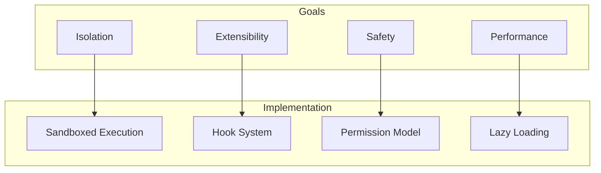
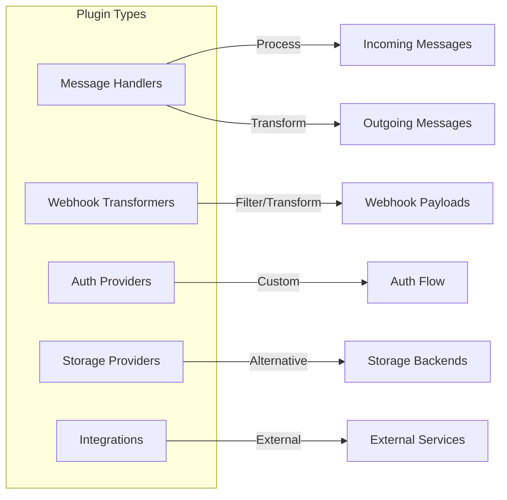
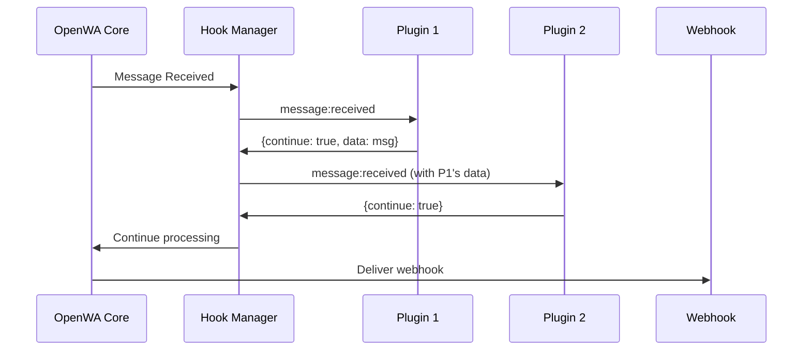

# 19 - Plugin Architecture

## Implementation Status

> **Current Status: ✅ Implemented**
>
> The plugin runtime — loader, hook bus, capability facade, permission enforcement, per-session
> activation, and a `worker_thread` sandbox for untrusted plugins — is shipped and wired.

| Component | Status | Location |
|-----------|--------|----------|
| **HookManager** | ✅ Implemented | `src/core/hooks/hook-manager.service.ts` |
| **PluginLoaderService** | ✅ Implemented | `src/core/plugins/plugin-loader.service.ts` |
| **PluginStorageService** | ✅ Implemented | `src/core/plugins/plugin-storage.service.ts` |
| **Manifest loading** | ✅ Implemented | Loads from `plugins/` directory |
| **Plugin lifecycle** | ✅ Implemented | onLoad, onEnable, onDisable, onUnload, onConfigChange, healthCheck |
| **Dashboard UI** | ✅ Implemented | `dashboard/src/pages/Plugins.tsx` |
| **REST API** | ✅ Implemented | `src/modules/plugins/plugins.controller.ts` |

| Component | Status | Notes |
|-----------|--------|-------|
| **Sandboxed execution** | ✅ Implemented | Untrusted (disk-loaded) plugins run in a `worker_thread`; see [23 — Plugin Sandboxing](./23-plugin-sandboxing.md). No `vm2`. |
| **Permission enforcement** | ✅ Implemented | Capability permissions enforced at the call boundary via `assertPermission` |
| **Per-session activation** | ✅ Implemented | A session-scoped plugin runs only for the sessions an operator activated it for |
| **Per-session config** | ✅ Implemented | Per-session config overrides shallow-merged over the base config at hook time |
| **Built-in plugins** | ✅ Implemented | The two engine adapters (`whatsapp-web.js`, `baileys`) register as in-process built-ins |
| **Plugin install / catalog** | ✅ Implemented | Install a `.zip` by upload or URL, or from the remote catalog |
| **@openwa/plugin-sdk** | 🔜 Planned | NPM package not yet published; plugins implement `IPlugin` directly today |

---

## 19.1 Overview

The plugin architecture enables OpenWA extensibility without modifying the core codebase. Plugins can add new features, integrate with external services, or customize behavior.

### Design Goals



1. **Isolation** - Untrusted plugins (anything loaded from the `plugins/` directory) run in a `worker_thread`, separate from in-process built-ins; capability calls round-trip to the host. First-party built-ins (the engine adapters) run in-process. A `worker_thread` is V8-context isolation in the same OS process, not an OS-level sandbox — see [23 — Plugin Sandboxing](./23-plugin-sandboxing.md) for what it does and does not guarantee, and the OS-containment guidance.
2. **Extensibility** - Easy to add new features
3. **Safety** - Capability permissions are enforced at the call boundary (`assertPermission` throws `PluginCapabilityError`), session scope is enforced per call, and outbound HTTP is SSRF-guarded.
4. **Performance** - Lazy loading, minimal overhead

## 19.2 Plugin Types

### Type Categories



| Type | Description | Examples |
|------|-------------|----------|
| Message Handler | Process incoming/outgoing messages | Auto-reply, Translation |
| Webhook Transformer | Transform webhook payloads | Add metadata, Filter events |
| Auth Provider | Custom authentication | OAuth, LDAP |
| Storage Provider | Alternative storage backends | Google Drive, Dropbox |
| Integration | External service integration | CRM, Analytics, n8n |

## 19.3 Plugin Structure

### Directory Structure

```
plugins/
├── my-plugin/
│   ├── package.json         # Plugin metadata
│   ├── index.ts              # Entry point
│   ├── manifest.json         # Permissions & config
│   ├── src/
│   │   ├── handlers/         # Message handlers
│   │   ├── hooks/            # Hook implementations
│   │   └── utils/            # Utilities
│   ├── config/
│   │   └── default.json      # Default config
│   └── README.md             # Documentation
```

### Manifest File

`id`, `name`, `version`, `type`, and `main` are required; the rest are optional. There is **no**
`types` field and **no** version-compatibility (`min`/`maxVersion`) check — the loader does not gate on
a host version. The config schema is the top-level `configSchema` (note: not nested under `config`).

```json
{
  "id": "my-awesome-plugin",
  "name": "My Awesome Plugin",
  "version": "1.0.0",
  "type": "extension",
  "description": "An awesome plugin for OpenWA",
  "author": "Your Name",
  "license": "MIT",

  "main": "dist/index.js",

  "permissions": ["messages:send", "engine:read", "net:fetch"],

  "sessionScoped": true,
  "sessions": ["*"],

  "net": { "allow": ["api.example.com"] },

  "hooks": ["message:received", "message:sending"],

  "provides": ["greeter"],
  "requires": [],

  "configSchema": {
    "type": "object",
    "properties": {
      "greeting": { "type": "string", "title": "Greeting", "default": "Hello" },
      "apiKey": { "type": "string", "title": "API key", "secret": true }
    }
  },

  "configUi": { "entry": "config-ui.html", "height": 480 },

  "i18n": {
    "es": { "name": "Mi complemento", "config": { "greeting": { "title": "Saludo" } } }
  }
}
```

| Field | Required | Meaning |
|-------|----------|---------|
| `id` | ✅ | Unique identifier (also the plugin's on-disk directory name) |
| `name` | ✅ | Display name |
| `version` | ✅ | Semver |
| `type` | ✅ | One of `engine`, `storage`, `queue`, `auth`, `extension` |
| `main` | ✅ | Entry file, resolved **inside** the plugin directory (a path that escapes it is rejected) |
| `permissions` | — | Capability permissions this plugin declares; absent/empty = no capability access |
| `sessions` | — | Session ids this plugin may act on, or `['*']`. Absent = `['*']`. Static — editing config can't widen it |
| `sessionScoped` | — | Default `true`. A scoped plugin only sees events for the sessions it's activated for; `false` = always runs |
| `net.allow` | — | Outbound-HTTP host allowlist for `ctx.net.fetch` (`host`, `host:port`, or `'*'`). Absent = deny all |
| `configSchema` | — | Declarative config schema the dashboard renders as a form when there is no `configUi`. Still required with one: it defines the fields, their types and which are `secret` |
| `configUi` | — | Optional self-contained HTML config editor served into a sandboxed iframe. When present it **replaces** the generated form and owns saving — the dashboard renders neither the form nor its Save button |
| `hooks` | — | Hook events this plugin listens to (informational) |
| `provides` / `requires` | — | Features this plugin provides / depends on |
| `i18n` | — | Localized dashboard text per locale (dashboard-only) |

**The `configUi` bridge.** The editor is injected as `srcdoc` into a `sandbox="allow-scripts"` iframe, so
it has an opaque origin and no access to the dashboard. It talks to the host by `postMessage`:

| Direction | Message | Notes |
| --- | --- | --- |
| iframe → host | `{ type: 'config:get' }` | Sent on load; the host answers with the current values |
| host → iframe | `{ type: 'config:value', config, schema, theme }` | `config` is already secret-redacted. `theme` is `'light'` or `'dark'`, resolved by the host |
| iframe → host | `{ type: 'config:save', config }` | The host makes the authenticated write |
| host → iframe | `{ type: 'config:saved' }` / `{ type: 'config:error', message }` | Outcome of that write |

`theme` matters because an opaque-origin iframe cannot read the dashboard's theme for itself; without it
an editor can only guess, and a light-only editor becomes a glaring white panel inside a dark modal. It is
sent once, with the handshake — the theme control sits behind the modal overlay, so the theme cannot
change while an editor is open. Treat it as optional: an editor that ignores it still works, and one that
uses it should fall back to `prefers-color-scheme` so it stays readable on an older host.

A `configSchema` field may set `secret: true` (e.g. an API key): the value is masked on read and
preserved on an unchanged write.

### Plugin Entry Point

A plugin's `main` module **default-exports a class** that implements `IPlugin`. All lifecycle methods
are optional and each receives only the `PluginContext` — there is no second `config` argument; config
is read from `ctx.config`.

```typescript
// plugins/my-plugin/index.ts

import type { IPlugin, PluginContext } from '@openwa/plugin-sdk'; // shape only; implement IPlugin

interface MyPluginConfig {
  greeting: string;
  apiKey?: string;
}

export default class MyAwesomePlugin implements IPlugin {
  async onLoad(ctx: PluginContext): Promise<void> {
    ctx.logger.log('Plugin loaded', { version: ctx.manifest.version });

    // Register a hook handler. Handlers receive a HookContext and return a HookResult.
    ctx.registerHook('message:received', async hookCtx => {
      const cfg = ctx.config as MyPluginConfig; // per-session-merged config for this event
      const { sessionId, data } = hookCtx;
      const message = data as { from: string; body?: string };

      if (message.body?.toLowerCase() === 'help' && sessionId) {
        // Capability call — requires the 'messages:send' permission + an in-scope, live session.
        await ctx.messages.sendText(sessionId, message.from, cfg.greeting ?? 'How can I help you?');
        return { continue: false }; // stop the chain
      }
      return { continue: true };
    });
  }

  async onEnable(_ctx: PluginContext): Promise<void> {}
  async onDisable(_ctx: PluginContext): Promise<void> {}
  async onUnload(ctx: PluginContext): Promise<void> {
    ctx.logger.log('Plugin unloading');
  }

  async onConfigChange(ctx: PluginContext, newConfig: Record<string, unknown>): Promise<void> {
    ctx.logger.log('Config changed', { keys: Object.keys(newConfig) });
  }

  async healthCheck(): Promise<{ healthy: boolean; message?: string }> {
    return { healthy: true };
  }
}
```

## 19.4 Plugin SDK

> Plugins implement the `IPlugin` interface directly. An `@openwa/plugin-sdk` npm package is planned
> but not yet published; the interfaces below are the live runtime contract from
> `src/core/plugins/plugin.interfaces.ts`.

### Core Interfaces

```typescript
// src/core/plugins/plugin.interfaces.ts

export interface IPlugin {
  // All optional; each receives only the PluginContext.
  onLoad?: (context: PluginContext) => Promise<void>;
  onEnable?: (context: PluginContext) => Promise<void>;
  onDisable?: (context: PluginContext) => Promise<void>;
  onUnload?: (context: PluginContext) => Promise<void>;
  onConfigChange?: (context: PluginContext, newConfig: Record<string, unknown>) => Promise<void>;
  healthCheck?: () => Promise<{ healthy: boolean; message?: string }>;
}

export interface PluginContext {
  pluginId: string;
  manifest: PluginManifest;

  // Effective config for the firing session (per-session override merged over the base). A getter,
  // so it reflects live config edits; outside a hook it returns the base config.
  config: Record<string, unknown>;

  hookManager: HookManager;
  logger: PluginLogger;        // log / debug / warn / error
  storage: PluginStorage;      // get / set / delete / list — scoped to this plugin

  // Register a hook handler (optionally with a priority; lower runs first).
  registerHook: (event: HookEvent, handler: HookHandler, priority?: number) => void;

  // Capability facade (permission- + scope-checked on each call):
  messages: PluginMessagingCapability; // requires 'messages:send'
  engine: PluginEngineReadCapability;  // requires 'engine:read' (read-only)
  net: PluginNetCapability;            // requires 'net:fetch' (SSRF-guarded, net.allow-scoped)
}

export interface PluginLogger {
  log(message: string, meta?: Record<string, unknown>): void;
  debug(message: string, meta?: Record<string, unknown>): void;
  warn(message: string, meta?: Record<string, unknown>): void;
  error(message: string, error?: unknown, meta?: Record<string, unknown>): void;
}
```

There is **no** `ctx.api`, `ctx.router`, or `ctx.events` — plugins do not mount HTTP routes or get an
event emitter. Hook handlers use the host `HookContext` / `HookResult` shape (see §19.5), not a
`{ continue, modified }` shape.

### Capability facade

A plugin reaches WhatsApp, the engine, and the network **only** through these three namespaces. Each
call is gated by the matching declared permission (and, for `messages`/`engine`, the session scope) —
a missing grant throws a `PluginCapabilityError`.

```typescript
// ctx.messages — requires 'messages:send'. Routes through MessageService (persistence preserved).
export interface PluginMessagingCapability {
  sendText(sessionId: string, chatId: string, text: string): Promise<MessageResponseDto>;
  reply(sessionId: string, chatId: string, quotedMessageId: string, text: string): Promise<MessageResponseDto>;
}

// ctx.engine — requires 'engine:read'. Read-only, scoped engine queries.
export interface PluginEngineReadCapability {
  getGroupInfo(sessionId: string, groupId: string): Promise<...>;
  getContacts(sessionId: string): Promise<...>;
  getContactById(sessionId: string, contactId: string): Promise<...>;
  checkNumberExists(sessionId: string, phone: string): Promise<...>;
  getChats(sessionId: string): Promise<...>;
}

// ctx.net — requires 'net:fetch'. Always through the host SSRF guard, scoped to manifest net.allow.
export interface PluginNetCapability {
  fetch(url: string, init?: PluginNetRequestInit): Promise<PluginNetResponse>;
}
```

`ctx.net.fetch` returns a serializable response (`{ ok, status, statusText, headers, body }`, body as
a string) — no streaming and no live `Response` object, because it must cross the worker boundary via
structured clone. The request has a default 15 s / hard-cap 30 s timeout and a 10 MB response cap.

### Plugin Storage

```typescript
// Key-value storage, scoped to the plugin (values cross structuredClone, so keep them serializable).
export interface PluginStorage {
  get<T = unknown>(key: string): Promise<T | null>;
  set<T = unknown>(key: string, value: T): Promise<void>;
  delete(key: string): Promise<void>;
  list(prefix?: string): Promise<string[]>;
}
```

## 19.5 Hook System

### Hook Lifecycle



A handler returns `{ continue: false }` to stop the chain. To transform the event it returns
`{ continue: true, data: <new value> }`; the next handler (and the host) sees that `data`. (There is
no `modified` field — the result type uses `data`.) A handler that both transforms and stops the chain
still has its `data` applied.

**What `continue: false` does and does not do.** On a **notification** event — `message:received`,
`message:sent` — it stops the remaining handlers and nothing else. The message has already arrived at,
or left, WhatsApp, so the gateway still persists it and still dispatches `message.received` /
`message.sent` to webhooks and the websocket. This is the flag an auto-reply plugin uses to claim a
message ("I answered this, don't let another bot answer it too"); it is not a way to hide a message from
the operator's own history.

On a **pre-action** event it is a veto, because the action has not been taken yet: `false` on
`message:sending` blocks the send (the caller gets a `400`), and on `webhook:before` it cancels that one
delivery.

> Until 0.10.5, `continue: false` on the two notification events also skipped persistence, the webhook
> and the websocket emit. An auto-reply plugin returning it for its ordinary purpose therefore erased
> the triggering message from the dashboard's chat history and from every integration downstream. If you
> wrote a plugin that relied on that to hide messages, it no longer does — filter on the consumer side
> instead.

### Hook events

```typescript
// src/core/hooks/hook.interfaces.ts

export type HookEvent =
  // Session lifecycle
  | 'session:created'
  | 'session:starting'
  | 'session:ready'
  | 'session:qr'
  | 'session:disconnected'
  | 'session:error'
  | 'session:deleted'
  // Message lifecycle
  | 'message:received'
  | 'message:sending'
  | 'message:sent'
  | 'message:failed'
  | 'message:ack'
  // Webhook lifecycle
  | 'webhook:before'
  | 'webhook:queued'
  | 'webhook:delivered'
  | 'webhook:after'
  | 'webhook:error';
```

### Hook context and result

```typescript
export interface HookContext<T = unknown> {
  event: HookEvent;
  data: T;             // the event payload (mutate via the returned HookResult.data)
  sessionId?: string;  // the session the event belongs to (used for activation + capability scope)
  timestamp: Date;
  source: string;      // which service emitted this
}

export interface HookResult<T = unknown> {
  continue: boolean;   // false = stop the chain
  data?: T;            // replacement payload for the next handler (only applied when error is absent)
  error?: Error;       // an error to propagate; the handler's data mutation is discarded
}

export type HookHandler<T = unknown> = (ctx: HookContext<T>) => Promise<HookResult<T>>;
```

### Hook Manager behavior

`HookManager` (`src/core/hooks/hook-manager.service.ts`) is a NestJS provider. Handlers are stored per
event and run in **priority order** (lower `priority` first; default `100`). On `execute(event, data,
{ sessionId, source })` it walks the chain, threading each handler's returned `data` into the next; a
handler that returns `{ continue: false }` stops the chain. A handler that **throws** is logged and the
chain continues with the previous data (one bad plugin can't break the chain). Same-event re-entrancy
is blocked: a handler that re-fires the event it is handling is short-circuited (guards synchronous
re-entry only). Plugins never call `HookManager` directly — they use `ctx.registerHook(...)`, which
also applies the per-session activation gate.

## 19.6 Plugin Loader

`PluginLoaderService` (`src/core/plugins/plugin-loader.service.ts`) is the NestJS provider that
discovers, loads, and runs plugins.

**Discovery & load.** On `onModuleInit` it registers built-in plugins programmatically (the engine
adapters; see §19.7), then scans the plugins directory (`plugins.dir`, default `./plugins`). For each
sub-directory with a `manifest.json` it reads the manifest, validates the required fields
(`id`/`name`/`version`/`type`/`main`), and records an `INSTALLED` plugin plus a persisted registry
entry — **without running any plugin code**. Persisted config and per-session activation/config are
read back so an operator's choices survive a restart. There is **no** version-compatibility check.

> Loading a plugin from disk never runs it: a load always yields `INSTALLED`. Enabling is a separate
> step that runs the lifecycle, and happens either on an explicit ADMIN action or — for a plugin the
> operator had already enabled — at bootstrap (see **Restore on boot** below).

**Restore on boot.** `status` describes where the runtime is, so it cannot carry the operator's
decision across a restart; the decision is persisted separately as `enabledByOperator`. On
`onApplicationBootstrap` — after the rest of the app is wired — the loader re-enables every non-built-in
plugin carrying that flag, so an upgrade, host reboot or container restart no longer silently switches
off every extension ([#856](https://github.com/rmyndharis/OpenWA/issues/856)). Restoring is best-effort
and sequential: a plugin that fails is logged (`plugin_restore_failed`), left in `ERROR`, and never
holds up startup. Built-ins are skipped — `EngineFactory` enables the engine named by `engine.type`.

> The flag is written **only** by the operator-facing enable/disable, never by the loader.
> `onModuleDestroy` disables every running plugin during a graceful shutdown, so a loader-side write
> would erase the decision on the way out.

**Enable.** `enablePlugin(id)` runs the lifecycle by trust tier (a synchronous lock prevents a racing
double-enable, and engines must match the configured active engine):

- **Built-in (trusted)** → `enableInProcess`: `require()` the `main` module (path-contained to the
  plugin dir), instantiate the default-exported class, and run `onLoad` then `onEnable` in-process with
  the live capability context.
- **Untrusted (disk-loaded)** → `enableSandboxed`: spawn a `worker_thread`, load the module there, and
  drive `onLoad`/`onEnable` over the channel. Capability calls and hook dispatches round-trip to the
  host, which runs the **same** permission + session-scope checks. Lifecycle calls are bounded by a
  30 s timeout and hooks by a 5 s timeout; a failure tears the worker back down. See
  [23 — Plugin Sandboxing](./23-plugin-sandboxing.md).

**Disable / unload / uninstall.** `disablePlugin` runs `onDisable` (force-terminating the worker for a
sandboxed plugin, even if `onDisable` hangs or throws) and unregisters the plugin's hooks. `onModuleDestroy`
disables every enabled plugin on graceful shutdown so stateful plugins can flush. `uninstallPlugin`
disables + unloads, drops the registry entry, and deletes the plugin's directory (built-ins are
protected and cannot be uninstalled).

**Context.** `createPluginContext` builds the `PluginContext` (§19.4): a per-plugin logger, plugin-scoped
storage, `registerHook` (wrapped with the per-session activation gate), the live `config` getter, and
the permission-checked `messages` / `engine` / `net` capabilities. The capability methods call
`assertPermission` (and, for messages/engine, `resolveEngine` → `assertSessionAllowed`) before doing any
work, so a missing grant or out-of-scope session fails fast with a `PluginCapabilityError`.

> ⚠️ **`ctx.storage` is plugin-scoped, not per-session — unlike `ctx.config`.** `ctx.config` is merged
> automatically for the firing session, but `ctx.storage` is a single namespace shared across **all** of a
> plugin's sessions. A multi-session plugin that keys state by a fixed string (mirroring the per-session
> config model) will have one session overwrite another's. Prefix storage keys with the session id (e.g.
> `ctx.storage.set(\`${sessionId}:lastSeen\`, …)`) whenever state must be isolated per session.

## 19.7 Built-in Plugins

The only plugins **shipped** as built-ins are the two WhatsApp **engine adapters**, registered
programmatically (not loaded from disk) by `EngineFactory` via `registerBuiltInPlugin`:

| Plugin id | Type | Notes |
|-----------|------|-------|
| `whatsapp-web.js` | `engine` | Default engine adapter (browser-based) |
| `baileys` | `engine` | WebSocket engine adapter (no browser) |

Engines are mutually exclusive: the active one is pinned by `engine.type` config, and `enablePlugin`
rejects any engine that is not the configured active one. Built-ins run **in-process** (trusted) — they
are not sandboxed. There is no `auto-reply` / `translation` plugin bundled in the source tree today.

### Example: a hook-based message plugin

A disk-installed extension implements `IPlugin`, registers hooks in `onLoad`, and uses the capability
facade. This auto-reply sketch needs only `messages:send` in its manifest `permissions`:

```typescript
// plugins/auto-reply/index.ts
import type { IPlugin, PluginContext } from '@openwa/plugin-sdk'; // shape only; implement IPlugin

interface AutoReplyConfig {
  enabled?: boolean;
  rules?: { match: string; reply: string }[];
}

export default class AutoReplyPlugin implements IPlugin {
  async onLoad(ctx: PluginContext): Promise<void> {
    ctx.registerHook('message:received', async hookCtx => {
      const cfg = ctx.config as AutoReplyConfig; // per-session-merged config for this event
      const { sessionId, data } = hookCtx;
      const message = data as { from: string; body?: string };
      if (cfg.enabled === false || !sessionId || !message.body) return { continue: true };

      const text = message.body.toLowerCase();
      const rule = (cfg.rules ?? []).find(r => text.includes(r.match.toLowerCase()));
      if (rule) {
        await ctx.messages.sendText(sessionId, message.from, rule.reply);
        await ctx.storage.set(`stats:replies:${Date.now()}`, rule.match);
      }
      return { continue: true }; // keep the chain going (still delivers the webhook)
    });

    ctx.logger.log('Auto-reply plugin loaded');
  }
}
```

A plugin that calls an external API instead would declare `net:fetch` plus the host in `net.allow`, and
use `await ctx.net.fetch('https://api.example.com/...', { method: 'POST', body, headers })` — the
SSRF-guarded outbound HTTP capability. A read-only plugin (e.g. enriching events with group/contact
data) would declare `engine:read` and call `ctx.engine.getGroupInfo(...)` / `ctx.engine.getContacts(...)`.

## 19.8 Plugin Management API

`PluginsController` (`src/modules/plugins/plugins.controller.ts`) is mounted at `plugins` and **every
route requires the `ADMIN` role** (`@RequireRole(ApiKeyRole.ADMIN)` — not a bare API-key guard). There
is **no** `POST :id/reload` and **no** `GET :id/config`. Install is a multipart `.zip` upload (or by
URL / catalog), not an npm/github source descriptor.

| Method & path | Purpose |
|---------------|---------|
| `GET /plugins` | List all plugins |
| `GET /plugins/catalog` | List the remote plugin catalog, annotated with install state |
| `GET /plugins/:id` | Get a single plugin |
| `POST /plugins/install` | Install from an uploaded `.zip` (`multipart/form-data`, field `file`, ≤ 5 MB) |
| `POST /plugins/install-url` | Install by downloading a `.zip` from a URL (SSRF-guarded) |
| `POST /plugins/:id/update` | Update an installed plugin in place from a URL (preserves config + enabled state) |
| `POST /plugins/:id/enable` | Enable a plugin |
| `POST /plugins/:id/disable` | Disable a plugin |
| `PUT /plugins/:id/config` | Update the plugin's base config |
| `PUT /plugins/:id/config/:sessionId` | Set (or clear, when empty) a per-session config override |
| `PUT /plugins/:id/sessions` | Set which sessions a session-scoped plugin is activated for (`['*']` = all) |
| `GET /plugins/:id/config-ui` | Serve the plugin's sandboxed config-UI HTML (for an iframe `srcdoc`) |
| `GET /plugins/:id/health` | Run the plugin's `healthCheck` |
| `DELETE /plugins/:id` | Uninstall a plugin (removes its files; built-ins are protected) |

> `GET /plugins/:id/config-ui` returns untrusted HTML served with `Content-Security-Policy: sandbox`
> and `X-Content-Type-Options: nosniff`. The dashboard fetches it **with** the API key and injects the
> body as an iframe `srcdoc` (opaque origin), applying the current document's CSP nonce to inline scripts;
> the editor exchanges config over a `postMessage` bridge, so the API key never reaches the iframe. If
> the bridge does not initialize, the dashboard shows an error and keeps a declared `configSchema` form usable.

## 19.9 Plugin Security

### Permission model

There are exactly **three** capability permissions, declared in the manifest `permissions` array and
enforced at the capability boundary:

```typescript
// src/core/plugins/plugin.interfaces.ts

export const PluginCapabilityPermission = {
  /** ctx.messages.* — send / reply on a session. */
  MESSAGES_SEND: 'messages:send',
  /** ctx.engine.* — read-only engine queries (group info, contacts, chats, number check). */
  ENGINE_READ: 'engine:read',
  /** ctx.net.fetch — SSRF-guarded outbound HTTP, scoped to the manifest net.allow host list. */
  NET_FETCH: 'net:fetch',
} as const;
```

There is no `PermissionChecker` class and no `PermissionDeniedError`. Enforcement lives in the loader:
each capability method calls `assertPermission(manifest, permission)` before doing any work, and a
plugin whose manifest does not declare the matching permission (or declares none) is rejected with a
`PluginCapabilityError`:

```typescript
// src/core/plugins/plugin-loader.service.ts (paraphrased)

private assertPermission(manifest: PluginManifest, permission: PluginCapabilityPermission): void {
  if (!(manifest.permissions ?? []).includes(permission)) {
    throw new PluginCapabilityError(
      `Plugin ${manifest.id} is missing the '${permission}' permission required for this capability`,
    );
  }
}
```

Two further checks apply on top of the permission:

- **Session scope.** `messages` and `engine` calls run `assertSessionAllowed(manifest, sessionId)` —
  the plugin may only act on sessions in its manifest `sessions` list (`['*']` = all). The `sessionId`
  comes from the plugin, so this is the security boundary; it is static (editing config can't widen it).
- **Network allowlist.** `ctx.net.fetch` additionally requires the target host to be in `manifest.net.allow`,
  and the request always passes through the SSRF guard (which blocks internal IPs even for an allowlisted host).

### Sandboxed execution

Untrusted plugins (anything loaded from the plugins directory) run in a Node `worker_thread`; there is
**no `vm2`**. First-party built-ins (the engine adapters) run in-process. The loader routes by trust
tier automatically. Key properties:

- Each worker has a heap cap (`maxOldGenerationSizeMb`, default **256 MB**) — an OOM terminates the
  worker, not the host.
- A sandboxed hook handler has a **5 s** time budget (`SANDBOX_HOOK_TIMEOUT_MS`); on timeout the host
  resolves `{ continue: true }` (fail-open) so a slow/wedged handler never stalls the hook chain. The
  same fail-open value drains in-flight hooks if the worker crashes.
- Lifecycle methods (`load`/`onLoad`/`onEnable`/`onDisable`) and `healthCheck` are bounded by a **30 s**
  / **5 s** timeout respectively, so a wedged plugin can't hang an ADMIN enable/disable or the health endpoint.
- The worker gets a **minimal allowlisted env** (`NODE_ENV`, `NODE_EXTRA_CA_CERTS`, `TZ`) — host secrets
  (master key, DB/Redis vars, …) are withheld.

This is V8-context isolation in the same OS process, not an OS-level sandbox: a worker can still reach
Node built-ins (`fs`, `process`, sockets). For genuinely untrusted plugins, combine it with OS
containment (the shipped Docker image runs read-only rootfs, non-root, `cap_drop: ALL`). See
[23 — Plugin Sandboxing](./23-plugin-sandboxing.md) for the full security model and author rules.

---

<div align="center">

[← 18 - SDK Design](./18-sdk-design.md) · [Documentation Index](./README.md) · [Next: 20 - Community Guidelines →](./20-community-guidelines.md)

</div>
